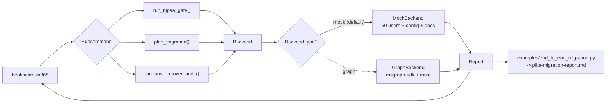

# Healthcare M365 migration

[](https://github.com/derekgallardo01/healthcare-m365-migration/actions/workflows/ci.yml) [](LICENSE) [](#) [](https://codespaces.new/derekgallardo01/healthcare-m365-migration)

**Docs:** [Getting started](docs/getting-started.md) · [Architecture](docs/architecture.md) · [Customization](docs/customization.md) · [Evaluation](docs/evaluation.md) · [Diagrams](docs/diagrams.md) · [FAQ](docs/faq.md)

**Live demo:** [derekgallardo01.github.io/healthcare-m365-migration](https://derekgallardo01.github.io/healthcare-m365-migration/) — full pilot-migration report generated against a 50-user mock healthcare tenant (8-check HIPAA gate + 4-wave plan + post-cutover audit), regenerated on every push.

**HIPAA-aware M365 migration** for healthcare orgs. Plans a phased cohort
migration, gates it on a HIPAA-specific config checklist with CFR
citations + remediation, and runs a post-cutover audit for stuck users,
MFA gaps, license waste, and unlabeled PHI.

The other M365 kits in this portfolio migrate. This one migrates
**with HIPAA compliance built into the gate**.

```bash
pip install -e .
healthcare-m365 demo                              # end-to-end walkthrough (mock tenant)
healthcare-m365 hipaa-gate                        # 8-check HIPAA config gate
healthcare-m365 plan-migration                    # phased cohort plan
healthcare-m365 post-cutover-audit                # after-cutover audit
healthcare-m365 hipaa-gate --json                 # every command has --json
```

```bash
python -m pytest -q     # 33 unit tests
python evals/run.py     # 5 golden eval cases against the mock tenant
```

Stdlib-only Python on the default path. `msgraph-sdk` + `msal` are
optional extras for the production Graph path.

## Run in Docker

```bash
docker build -t healthcare-m365 .
docker run --rm healthcare-m365                              # `healthcare-m365 demo`
docker run --rm healthcare-m365 pytest -q                    # tests
docker run --rm healthcare-m365 healthcare-m365 hipaa-gate --json
```

## Example: production scenario

**[examples/end_to_end_migration.py](examples/end_to_end_migration.py)** — Runs all four phases (discovery → HIPAA gate → wave plan → post-cutover audit) and emits a single markdown report (`pilot-migration-report.md`) that a delivery lead can hand to the practice manager on the day of cutover.

```bash
python examples/end_to_end_migration.py
```

## What it's for

Every healthcare M365 migration hits the same four questions on day one:

1. **"Is this tenant even safe to migrate PHI into?"** — DLP, sensitivity
   labels, Purview retention, Copilot data residency, audit log,
   external sharing, MFA, unlabeled-document scan.
2. **"Who goes first, second, third?"** — pilot cohort (mixed
   departments, all MFA-ready), wave 1 (largest single department),
   wave 2 (remainder), cleanup (former staff to offboard).
3. **"Which users can't migrate yet?"** — MFA gaps flagged per wave as
   blockers that must be resolved before that wave's cutover.
4. **"What broke after wave 1?"** — stuck users (no signin post-cutover),
   MFA gaps, former staff still holding a paid license (with $/mo
   waste), PHI documents that landed in the new tenant without a
   sensitivity label.

The kit gives you all four with one CLI + one bundled mock tenant, so
the discovery + gate + plan + audit report can be demonstrated in a
sales call before the client hands over Graph credentials.

The other M365 kits in this portfolio handle the mechanical bits:
- [graph-automation-scripts](https://github.com/derekgallardo01/graph-automation-scripts) — 6 admin scripts (license audit, inactive users, mailbox cleanup, MFA gaps) that run on the target tenant
- [m365-privacy-config](https://github.com/derekgallardo01/m365-privacy-config) — 40+ item M365 privacy checklist (broader, not HIPAA-specific)
- [ms-delivery-discovery-kit](https://github.com/derekgallardo01/ms-delivery-discovery-kit) — the discovery + SOW template that wraps around a migration engagement

This kit adds the **HIPAA-specific gate + phased wave planner +
post-cutover audit** to the delivery bundle.

## The HIPAA gate

8 tenant-config checks, each with a CFR citation and a concrete
remediation step:

| Check | HIPAA citation | What it catches |
|---|---|---|
| PHI DLP policy enabled | 164.312(a)(1) | No DLP is scanning for PHI patterns |
| PHI sensitivity label published | 164.312(c)(1) | Users have no way to mark PHI |
| Purview retention >= 6 years | 164.316(b)(2)(i) | Retention shorter than HIPAA's 6-year rule |
| Copilot data residency in US | 164.308(b)(1) | Copilot processing outside US geography |
| Unified audit log >= 365 days | 164.312(b) | Breach investigations need 12+ months |
| External sharing restricted | 164.312(a)(1) | PHI can be shared with anyone-with-link |
| MFA required tenant-wide | 164.312(d) | Any user without MFA is a compliance risk |
| All PHI documents carry a sensitivity label | 164.312(c)(1) | PHI files land in the tenant unlabeled |

```
$ healthcare-m365 hipaa-gate
HIPAA gate: 1 pass, 0 warn, 7 fail  [BLOCKED]

  [FAIL] PHI DLP policy enabled   (164.312(a)(1) - access control)
         No DLP policy is scanning for PHI patterns (SSN, MRN, DOB combinations).
         Fix: In Purview -> Data loss prevention -> Policies, create a policy scoped
         to Exchange + SharePoint + OneDrive using the built-in 'U.S. Health
         Insurance Act (HIPAA)' template. Set enforcement mode to 'Test with
         notifications' for 7 days, then flip to 'Turn on'.
  ...
```

## The wave planner

```
$ healthcare-m365 plan-migration
48 active users across 4 waves | 262.9 GB mailbox data to migrate | 2 former accounts to offboard | 1 planning warning(s)

  Wave 1: Pilot   9 users   10.8h est
    - Jake Li                  Admin      SPE_E5
    - Kim Ma                   Admin      SPE_E5
    ...
  Wave 2: Wave 1 - Clinical   23 users   13.8h est
  Wave 3: Wave 2 - remaining active   16 users   9.6h est
  Wave 4: Cleanup - former staff (offboard, do not migrate)   2 users   0.4h est
```

The planner enforces four invariants:

1. **Pilot is capped at 10 users.** No 50-user "pilots" that are
   actually the whole org.
2. **Pilot users must have MFA registered.** No user without MFA can be
   in the pilot cohort.
3. **Every active user is placed in exactly one wave** (except former
   staff, who go to the cleanup wave).
4. **MFA gaps become per-wave blockers** — the delivery lead sees them
   in the plan before that wave's cutover date.

## Architecture



The backend is the swap point. `MockBackend` ships with the kit;
replace it with `GraphBackend` (implementing the same 4 read methods
against the live Graph endpoint) and every downstream call is unchanged.

## Wiring to the real Microsoft Graph

The `MockBackend` class in `src/healthcare_m365/backend.py` defines the
API surface (4 methods: `list_users`, `list_source_mailboxes`,
`list_documents`, `get_tenant_config`). A production `GraphBackend`
implementing those methods is ~150 lines of `msgraph-sdk` + `msal`
glue. See [`docs/customization.md`](docs/customization.md) for the
sketch.

Wire it into `get_backend()` in `backend.py`. The HIPAA gate, wave
planner, and post-cutover audit are unchanged.

## What's inside

| Path | Purpose |
|---|---|
| `src/healthcare_m365/backend.py` | MockBackend (50 users + 3 depts + 3 SKUs + docs + tenant config) + Backend protocol + GraphBackend sketch |
| `src/healthcare_m365/hipaa_gate.py` | 8 HIPAA-specific checks with CFR citations + remediation |
| `src/healthcare_m365/migration_planner.py` | Phased 4-wave planner (pilot / wave 1 / wave 2 / cleanup) |
| `src/healthcare_m365/post_cutover_audit.py` | Post-cutover audit (stuck / MFA / former-licensed / unlabeled PHI) |
| `src/healthcare_m365/cli.py` | `hipaa-gate / plan-migration / post-cutover-audit / demo` |
| `examples/end_to_end_migration.py` | Full four-phase run -> markdown report |
| `tests/` | 33 pytest tests across backend + gate + planner + audit |
| `evals/golden.json` | 5 golden cases with path-based assertions |
| `evals/run.py` | Eval harness |
| `pyproject.toml` | Package + `healthcare-m365` script entry |

## Companion repos

- [graph-automation-scripts](https://github.com/derekgallardo01/graph-automation-scripts) — the mechanical admin-script side of a migration (license audit, MFA gaps, inactive users).
- [m365-privacy-config](https://github.com/derekgallardo01/m365-privacy-config) — the broader M365 + Copilot privacy checklist (not HIPAA-specific). Use this on non-healthcare tenants.
- [ms-delivery-discovery-kit](https://github.com/derekgallardo01/ms-delivery-discovery-kit) — the discovery + SOW template that wraps a healthcare-migration engagement.
- [project-handover-pack](https://github.com/derekgallardo01/project-handover-pack) — handover deliverable at end of engagement (runbook + Loom script + go-live checklist).
