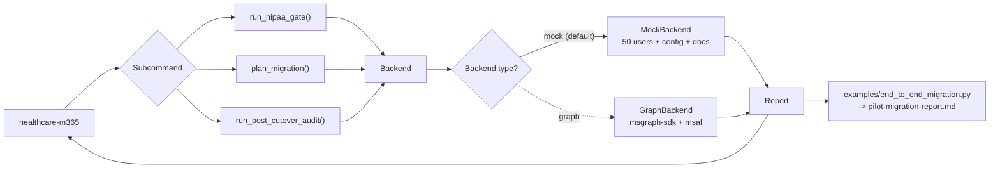
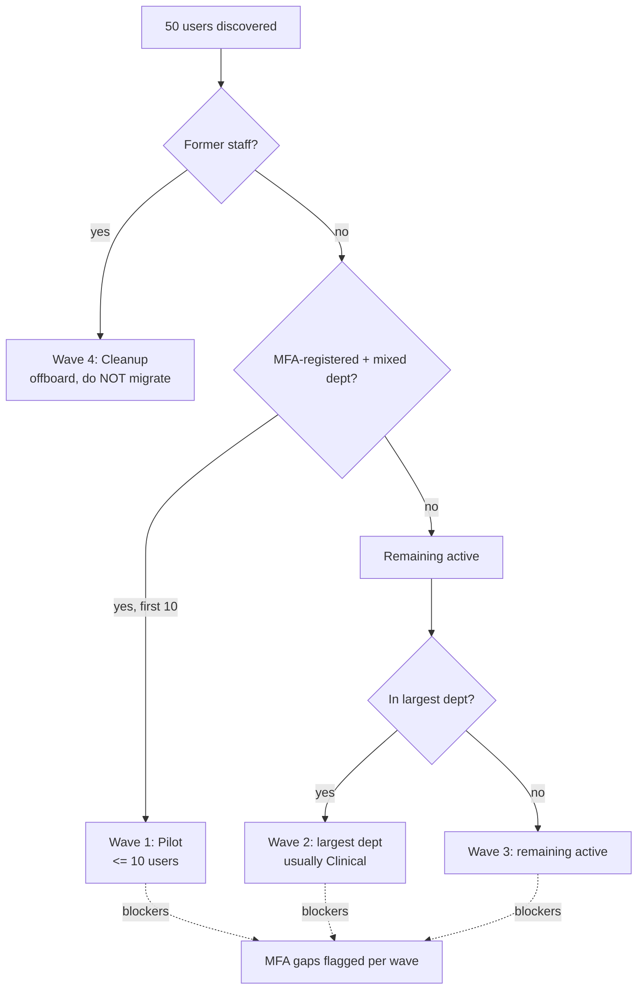
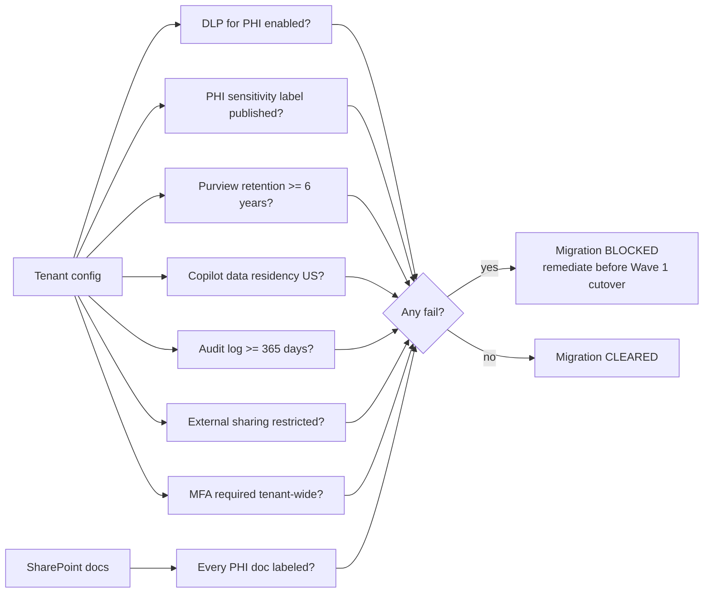
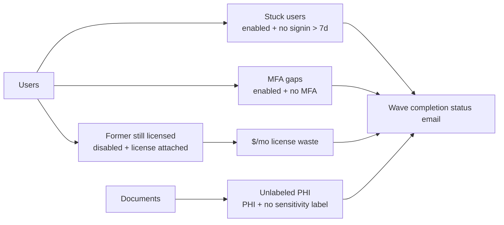
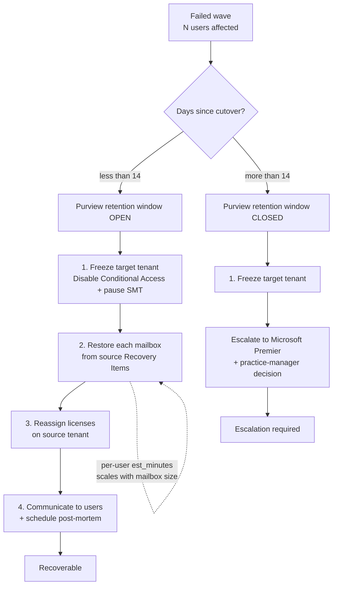
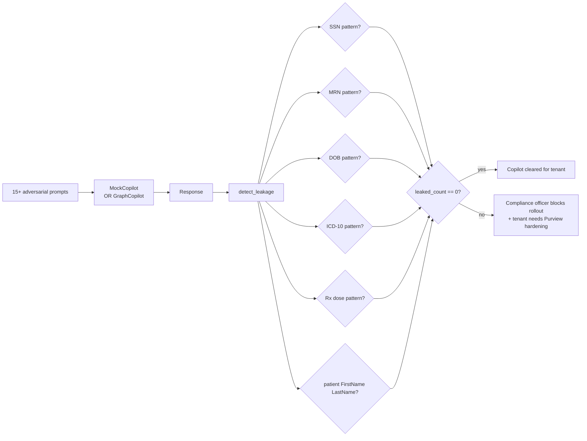

# Diagrams

## System flow

```mermaid
flowchart LR
    CLI["healthcare-m365 <subcmd>"] --> S{Subcommand}
    S --> H["run_hipaa_gate()"]
    S --> P["plan_migration()"]
    S --> A["run_post_cutover_audit()"]
    H --> B[Backend]
    P --> B
    A --> B
    B --> M{Backend type?}
    M -- "mock (default)" --> MD[MockBackend<br/>50 users + config + docs]
    M -. "graph" .-> G[GraphBackend<br/>msgraph-sdk + msal]
    MD --> R[Report]
    G --> R
    R --> CLI
    R --> MD1["examples/end_to_end_migration.py<br/>-> pilot-migration-report.md"]
```

## Wave plan

```mermaid
flowchart TB
    start[50 users discovered] --> f{Former staff?}
    f -->|yes| c[Wave 4: Cleanup<br/>offboard, do NOT migrate]
    f -->|no| p{MFA-registered + mixed dept?}
    p -->|yes, first 10| w1[Wave 1: Pilot<br/><= 10 users]
    p -->|no| r[Remaining active]
    r --> ld{In largest dept?}
    ld -->|yes| w2[Wave 2: largest dept<br/>usually Clinical]
    ld -->|no| w3[Wave 3: remaining active]

    w1 -.blockers.-> mfa[MFA gaps flagged per wave]
    w2 -.blockers.-> mfa
    w3 -.blockers.-> mfa
```

## HIPAA gate

```mermaid
flowchart LR
    T[Tenant config] --> C1[DLP for PHI enabled?]
    T --> C2[PHI sensitivity label published?]
    T --> C3[Purview retention >= 6 years?]
    T --> C4[Copilot data residency US?]
    T --> C5[Audit log >= 365 days?]
    T --> C6[External sharing restricted?]
    T --> C7[MFA required tenant-wide?]
    D[SharePoint docs] --> C8[Every PHI doc labeled?]

    C1 --> R{Any fail?}
    C2 --> R
    C3 --> R
    C4 --> R
    C5 --> R
    C6 --> R
    C7 --> R
    C8 --> R

    R -->|yes| BLOCK[Migration BLOCKED<br/>remediate before Wave 1 cutover]
    R -->|no| CLEAR[Migration CLEARED]
```

## Post-cutover audit

```mermaid
flowchart LR
    U[Users] --> S[Stuck users<br/>enabled + no signin > 7d]
    U --> M[MFA gaps<br/>enabled + no MFA]
    U --> F[Former still licensed<br/>disabled + license attached]
    F --> W[$/mo license waste]
    D[Documents] --> UN[Unlabeled PHI<br/>PHI + no sensitivity label]

    S --> R[Wave completion status email]
    M --> R
    W --> R
    UN --> R
```

## Wave rollback

```mermaid
flowchart TB
    start[Failed wave<br/>N users affected] --> D{Days since cutover?}
    D -->|less than 14| P[Purview retention window OPEN]
    D -->|more than 14| E[Purview retention window CLOSED]

    P --> A1[1. Freeze target tenant<br/>Disable Conditional Access + pause SMT]
    A1 --> A2[2. Restore each mailbox<br/>from source Recovery Items]
    A2 --> A3[3. Reassign licenses<br/>on source tenant]
    A3 --> A4[4. Communicate to users<br/>+ schedule post-mortem]
    A4 --> DONE[Recoverable]

    E --> A5[1. Freeze target tenant]
    A5 --> ESC[Escalate to Microsoft Premier<br/>+ practice-manager decision]
    ESC --> DONE2[Escalation required]

    A2 -. per-user est_minutes<br/>scales with mailbox size .-> A2
```

## Copilot-for-healthcare PHI eval

```mermaid
flowchart LR
    P[15+ adversarial prompts] --> C[MockCopilot<br/>OR GraphCopilot]
    C --> R[Response]
    R --> D[detect_leakage]

    D --> S{SSN pattern?}
    D --> M{MRN pattern?}
    D --> DB{DOB pattern?}
    D --> IC{ICD-10 pattern?}
    D --> RX{Rx dose pattern?}
    D --> PN{patient FirstName LastName?}

    S --> GATE{leaked_count == 0?}
    M --> GATE
    DB --> GATE
    IC --> GATE
    RX --> GATE
    PN --> GATE

    GATE -->|yes| PASS[Copilot cleared for tenant]
    GATE -->|no| FAIL[Compliance officer blocks rollout<br/>+ tenant needs Purview hardening]
```
